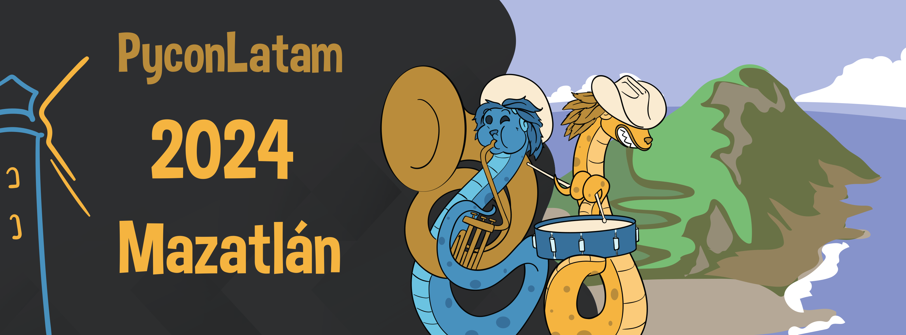
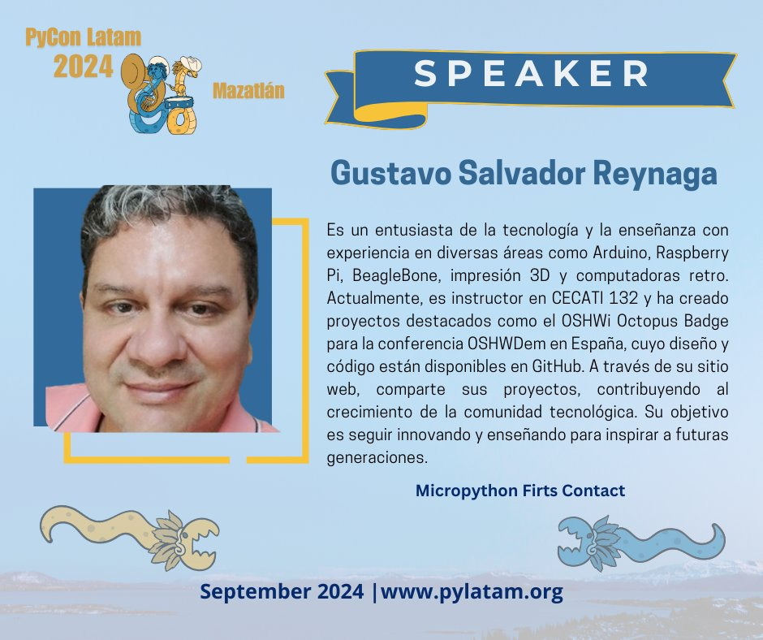

# Pycon LATAM 2024
 

## Material de la platica "Primer contacto con Micropython" impartida en Pycon Latam 2024

### El objetivo de esta platica es ofrecer una pequeña muestra sobre cómo implementar Micropython usando la tarjeta Arduino Nano RP2040 Connect.

**Contenido**

1. Primer contacto con Micropython
2. Sistemas embebidos	
3. ¿Qué es Micropython?	
4. ¿Por qué usar Micropython?	
5. ¿Qué es un Microcontrolador?	
6. Comunicación	
7. Pines GPIO	
8. Programación	
9. La tarjeta Arduino Nano RP2040	
10. Instalación del firmware MicroPython	
11. Obtener el IDE Arduino Lab for MicroPython	
12. Primer programa en MicroPython.	
13. Pinout Arduino Nano RP2040	
14. Pinout Microcontrolador RP2040	
15. Mostrar todos los pines disponibles	
16. Accediendo a sensores con MicroPython	
17. IoT	
18. Conectividad WiFI	
- A) Búsqueda de redes wifi	
- B) Hacer una solicitud a una API	
19. Conclusiones	

